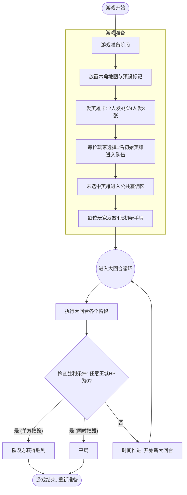
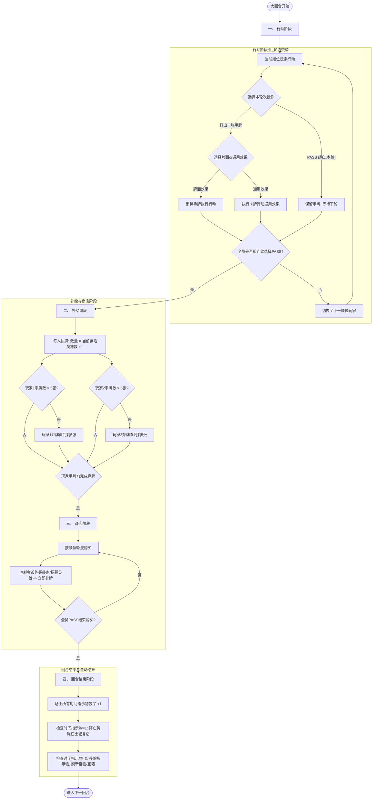
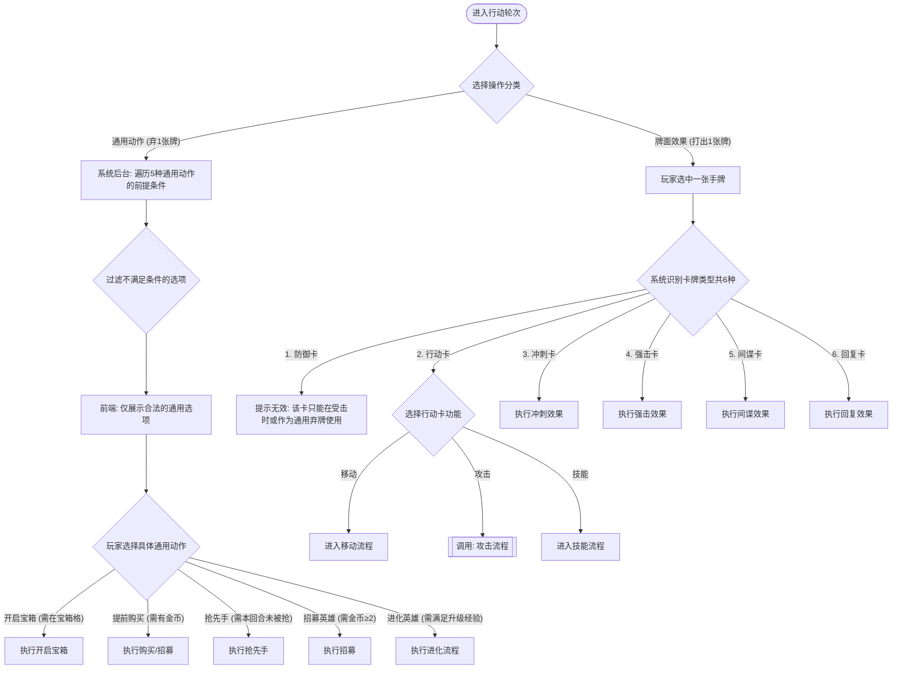
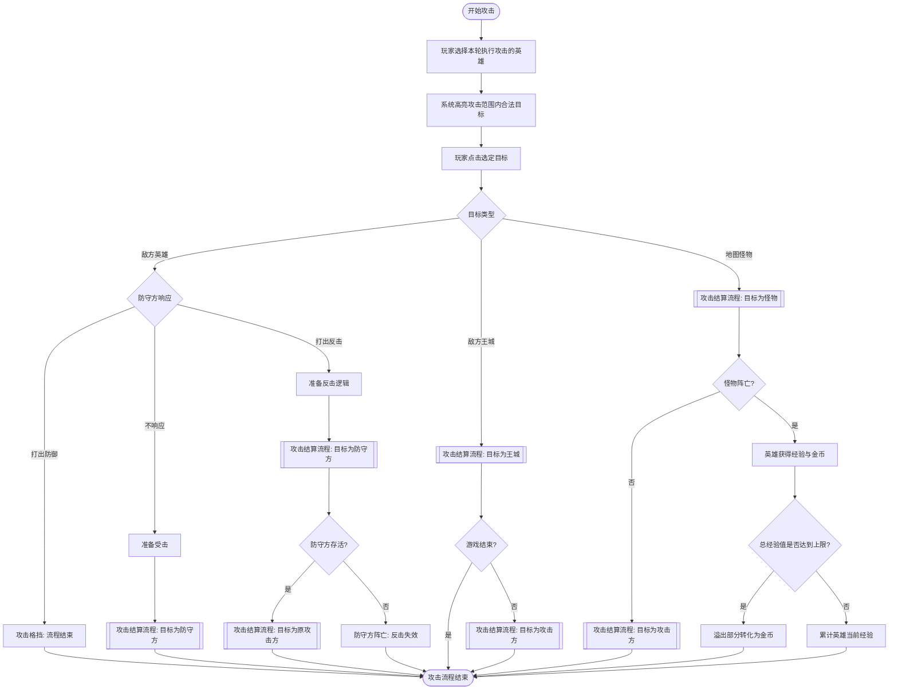
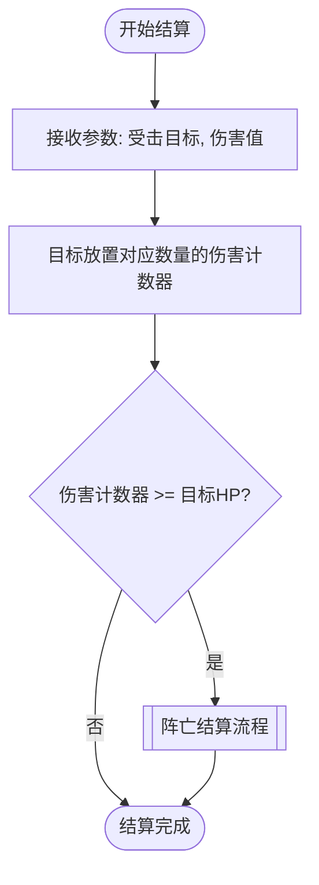
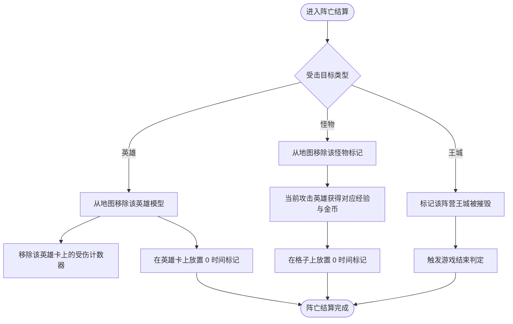

```mermaid
graph TD
    Start([游戏开始]) --> Setup[游戏准备阶段]
    
    subgraph 游戏准备
        Setup --> PlaceMap[放置六角地图与预设标记]
        PlaceMap --> DealHeroes[发英雄卡: 2人发4张/4人发3张]
        DealHeroes --> SelectHero[每位玩家选择1名初始英雄进入队伍]
        SelectHero --> Pool[未选中英雄进入公共雇佣区]
        Pool --> DealCards[每位玩家发放4张初始手牌]
    end

    DealCards --> RoundLoop((进入大回合循环))

    RoundLoop --> MainRound[执行大回合各个阶段]
    MainRound --> CheckWin{检查胜利条件: 任意王城HP为0?}
    
    CheckWin -- "是 (单方摧毁)" --> Winner[摧毁方获得胜利]
    CheckWin -- "是 (同时摧毁)" --> Draw[平局]
    Winner --> End([游戏结束, 重新准备])
    Draw --> End
    
    CheckWin -- "否" --> StartNextRound[时间推进, 开始新大回合]
    StartNextRound --> RoundLoop
```

```mermaid
graph TD
    RoundStart([大回合开始]) --> ActionPhase[一、 行动阶段]
    ActionPhase[一、 行动阶段] --> PlayerTurn[当前顺位玩家行动]

    subgraph 行动阶段圈_轮流交替
        PlayerTurn[当前顺位玩家行动] --> ActionChoice{选择本轮次操作}
        
        ActionChoice -- "打出一张手牌" --> SelSpAction{选择牌面or通用效果}       
        ActionChoice -- "PASS (跳过本轮)" --> PassTurn[保留手牌, 等待下轮]

        SelSpAction -- "牌面效果" --> PlayCard[消耗手牌执行行动]
        SelSpAction -- "通用效果" --> CommonAct[执行卡牌行动通用效果]

        PlayCard --> CheckAllPass
        CommonAct --> CheckAllPass
        PassTurn --> CheckAllPass
        
        CheckAllPass{全员是否都连续选择PASS?}
        CheckAllPass -- "否" --> NextPlayer[切换至下一顺位玩家]
        NextPlayer --> PlayerTurn
    end

    CheckAllPass -- "是" --> SupplyPhase[二、 补给阶段]

    subgraph 补给与商店阶段
        SupplyPhase --> DrawCards[每人抽牌: 数量 = 当前存活英雄数 + 1]
        DrawCards --> CheckHand1{玩家1手牌数 > 5张?}
        DrawCards --> CheckHand2{玩家2手牌数 > 5张?}
        CheckHand1 -- "是" --> Drop1[玩家1弃牌直到剩5张]
        CheckHand1 -- "否" --> BothHandOk{玩家手牌均完成弃牌}
        Drop1 --> BothHandOk

        CheckHand2 -- "是" --> Drop2[玩家2弃牌直到剩5张]
        CheckHand2 -- "否" --> BothHandOk
        Drop2 --> BothHandOk

        BothHandOk --"是" --> ShopPhase[三、 商店阶段]
        
        ShopPhase --> ShopTurn[按顺位轮流购买]
        ShopTurn --> BuyLogic[消耗金币购买装备/招募英雄 -> 立即补牌]
        BuyLogic --> CheckShopPass{全员PASS结束购买?}
        CheckShopPass -- "否" --> ShopTurn
    end

    CheckShopPass -- "是" --> EndPhase[四、 回合结束阶段]

    subgraph 回合结束与自动结算
        EndPhase --> TimePlus[场上所有时间指示物数字 +1]
        TimePlus --> CheckRespawn[检查时间指示物=1: 阵亡英雄在王城复活]
        CheckRespawn --> CheckRefresh[检查时间指示物=3: 移除指示物, 刷新怪物/宝箱]
    end

    CheckRefresh --> NextRound([进入下一回合])
```

```mermaid
graph TD
    StartAction([进入行动轮次]) --> SelSpAction{选择操作分类}

    %% ================= 通用效果分支 =================
    SelSpAction -- "通用动作 (弃1张牌)" --> SysCheck[系统后台: 遍历5种通用动作的前提条件]
    
    SysCheck --> ConditionFilter{过滤不满足条件的选项}
    ConditionFilter --> ShowValid[前端: 仅展示合法的通用选项]

    ShowValid --> CommonChoice{玩家选择具体通用动作}
    CommonChoice -- "开启宝箱 (需在宝箱格)" --> OpenChest[执行开启宝箱]
    CommonChoice -- "提前购买 (需有金币)" --> EarlyBuy[执行购买/招募]
    CommonChoice -- "抢先手 (需本回合未被抢)" --> StealInit[执行抢先手]
    CommonChoice -- "招募英雄 (需金币≥2)" --> Recruit[执行招募]
    CommonChoice -- "进化英雄 (需满足升级经验)" --> Evolve[执行进化流程]

    %% ================= 牌面效果分支 =================
    SelSpAction -- "牌面效果 (打出1张牌)" --> SelectCard[玩家选中一张手牌]
    
    SelectCard --> CardType{系统识别卡牌类型共6种}

    CardType -- "1. 防御卡" --> Invalid[提示无效: 该卡只能在受击时或作为通用弃牌使用]
    
    CardType -- "2. 行动卡" --> ActionCardChoice{选择行动卡功能}
    ActionCardChoice -- "移动" --> MoveFlow[进入移动流程]
    ActionCardChoice -- "攻击" --> AttackFlow[[调用: 攻击流程]]
    ActionCardChoice -- "技能" --> SkillFlow[进入技能流程]

    CardType -- "3. 冲刺卡" --> DashFlow[执行冲刺效果]
    CardType -- "4. 强击卡" --> HeavyFlow[执行强击效果]
    CardType -- "5. 间谍卡" --> SpyFlow[执行间谍效果]
    CardType -- "6. 回复卡" --> HealFlow[执行回复效果]
```    

```mermaid
graph TD
    StartAttack([开始攻击]) --> SelectHero[玩家选择本轮执行攻击的英雄]
    SelectHero --> HighLight[系统高亮攻击范围内合法目标]
    HighLight --> SelectTarget[玩家点击选定目标]

    SelectTarget --> TargetType{目标类型}

    %% --------- 攻击英雄 ---------
    TargetType -- "敌方英雄" --> DefendLogic{防守方响应}
    DefendLogic -- "打出防御" --> Block[攻击格挡: 流程结束]
    DefendLogic -- "打出反击" --> HeroCounter[准备反击逻辑]
    DefendLogic -- "不响应" --> NormalHit[准备受击]

    NormalHit --> Res1[[攻击结算流程: 目标为防守方]]
    HeroCounter --> Res2[[攻击结算流程: 目标为防守方]]
    
    Res2 --> CheckCounterDeath{防守方存活?}
    CheckCounterDeath -- "是" --> ExecCounter[[攻击结算流程: 目标为原攻击方]]
    CheckCounterDeath -- "否" --> CounterFail[防守方阵亡: 反击失效]

    %% --------- 攻击王城 ---------
    TargetType -- "敌方王城" --> ResBase[[攻击结算流程: 目标为王城]]
    ResBase --> CheckGameEnd{游戏结束?}
    CheckGameEnd -- "否" --> BaseCounter[[攻击结算流程: 目标为攻击方]]

    %% --------- 攻击怪物 ---------
    TargetType -- "地图怪物" --> ResMonster[[攻击结算流程: 目标为怪物]]
    ResMonster --> CheckMonsterDie{怪物阵亡?}
    CheckMonsterDie -- "否" --> MonsterCounter[[攻击结算流程: 目标为攻击方]]
    CheckMonsterDie -- "是" --> GainExp[英雄获得经验与金币]

    %% --------- 经验计算与转换 ---------
    GainExp --> ExpCalc{总经验值是否达到上限?}
    ExpCalc -- "是" --> ExpToGold[溢出部分转化为金币]
    ExpCalc -- "否" --> AddExp[累计英雄当前经验]
    
    %% --------- 汇合结束 ---------
    Block --> AttackEnd
    Res1 --> AttackEnd
    ExecCounter --> AttackEnd
    CounterFail --> AttackEnd
    CheckGameEnd -- "是" --> AttackEnd
    BaseCounter --> AttackEnd
    MonsterCounter --> AttackEnd
    ExpToGold --> AttackEnd
    AddExp --> AttackEnd

    AttackEnd([攻击流程结束])
```    

```mermaid
graph TD
    StartRes([开始结算]) --> Input[接收参数: 受击目标, 伤害值]
    Input --> ApplyDmg[目标放置对应数量的伤害计数器]
    
    ApplyDmg --> CheckStatus{伤害计数器 >= 目标HP?}
    
    CheckStatus -- "否" --> ResFinish([结算完成])
    
    CheckStatus -- "是" --> CallDeath[[阵亡结算流程]]
    
    CallDeath --> ResFinish
```

```mermaid
graph TD
    StartDeath([进入阵亡结算]) --> IdentifyType{受击目标类型}

    %% --- 英雄阵亡 ---
    IdentifyType -- "英雄" --> HeroProcess[从地图移除该英雄模型]
    HeroProcess --> ClearDmg[移除该英雄卡上的受伤计数器]
    HeroProcess --> SetRespawn[在英雄卡上放置 0 时间标记]
    SetRespawn --> DeathDone

    %% --- 怪物阵亡 ---
    IdentifyType -- "怪物" --> MonsterProcess[从地图移除该怪物标记]
    MonsterProcess --> DropReward[当前攻击英雄获得对应经验与金币]
    DropReward --> SetRefresh[在格子上放置 0 时间标记]
    SetRefresh --> DeathDone

    %% --- 王城被毁 ---
    IdentifyType -- "王城" --> BaseProcess[标记该阵营王城被摧毁]
    BaseProcess --> GameEnd[触发游戏结束判定]
    GameEnd --> DeathDone

    DeathDone([阵亡结算完成]) 
```    

