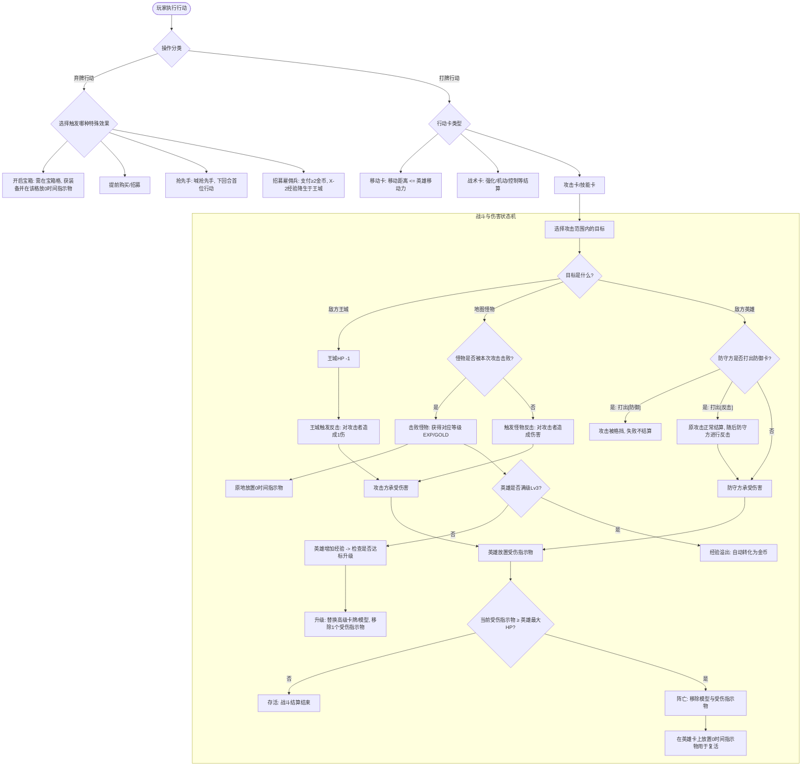

```mermaid
graph TD
    Start([游戏开始]) --> Setup[游戏准备阶段]
    
    subgraph 游戏准备
        Setup --> PlaceMap[放置六角地图与预设标记]
        PlaceMap --> DealHeroes[发英雄卡: 2人发4张/4人发3张]
        DealHeroes --> SelectHero[每位玩家选择1名初始英雄进入队伍]
        SelectHero --> Pool[未选中英雄进入公共雇佣区]
        Pool --> DealCards[每位玩家发放4张初始手牌]
    end

    DealCards --> RoundLoop((进入大回合循环))

    RoundLoop --> MainRound[执行大回合各个阶段]
    MainRound --> CheckWin{检查胜利条件: 任意王城HP为0?}
    
    CheckWin -- "是 (单方摧毁)" --> Winner[摧毁方获得胜利]
    CheckWin -- "是 (同时摧毁)" --> Draw[平局]
    Winner --> End([游戏结束, 重新准备])
    Draw --> End
    
    CheckWin -- "否" --> StartNextRound[时间推进, 开始新大回合]
    StartNextRound --> RoundLoop
```

```mermaid
graph TD
    RoundStart([大回合开始]) --> ActionPhase[一、 行动阶段]
    ActionPhase[一、 行动阶段] --> PlayerTurn[当前顺位玩家行动]

    subgraph 行动阶段圈_轮流交替
        PlayerTurn[当前顺位玩家行动] --> ActionChoice{选择本轮次操作}
        
        ActionChoice -- "打出一张手牌" --> SelSpAction{选择牌面or通用效果}       
        ActionChoice -- "PASS (跳过本轮)" --> PassTurn[保留手牌, 等待下轮]

        SelSpAction -- "牌面效果" --> PlayCard[消耗手牌执行行动]
        SelSpAction -- "通用效果" --> CommonAct[执行卡牌行动通用效果]

        PlayCard --> CheckAllPass
        CommonAct --> CheckAllPass
        PassTurn --> CheckAllPass
        
        CheckAllPass{全员是否都连续选择PASS?}
        CheckAllPass -- "否" --> NextPlayer[切换至下一顺位玩家]
        NextPlayer --> PlayerTurn
    end

    CheckAllPass -- "是" --> SupplyPhase[二、 补给阶段]

    subgraph 补给与商店阶段
        SupplyPhase --> DrawCards[每人抽牌: 数量 = 当前存活英雄数 + 1]
        DrawCards --> CheckHand1{玩家1手牌数 > 5张?}
        DrawCards --> CheckHand2{玩家2手牌数 > 5张?}
        CheckHand1 -- "是" --> Drop1[玩家1弃牌直到剩5张]
        CheckHand1 -- "否" --> BothHandOk{玩家手牌均完成弃牌}
        Drop1 --> BothHandOk

        CheckHand2 -- "是" --> Drop2[玩家2弃牌直到剩5张]
        CheckHand2 -- "否" --> BothHandOk
        Drop2 --> BothHandOk

        BothHandOk --"是" --> ShopPhase[三、 商店阶段]
        
        ShopPhase --> ShopTurn[按顺位轮流购买]
        ShopTurn --> BuyLogic[消耗金币购买装备/招募英雄 -> 立即补牌]
        BuyLogic --> CheckShopPass{全员PASS结束购买?}
        CheckShopPass -- "否" --> ShopTurn
    end

    CheckShopPass -- "是" --> EndPhase[四、 回合结束阶段]

    subgraph 回合结束与自动结算
        EndPhase --> TimePlus[场上所有时间指示物数字 +1]
        TimePlus --> CheckRespawn[检查时间指示物=1: 阵亡英雄在王城复活]
        CheckRespawn --> CheckRefresh[检查时间指示物=3: 移除指示物, 刷新怪物/宝箱]
    end

    CheckRefresh --> NextRound([进入下一回合])
```

```mermaid
graph TD
    StartAction([玩家执行行动]) --> ActionType{操作分类}

    %% =========== 弃牌分支 ===========
    ActionType -- "弃牌行动" --> DiscardChoice{选择触发哪种特殊效果}
    DiscardChoice --> OpenChest[开启宝箱: 需在宝箱格, 获装备并在该格放0时间指示物]
    DiscardChoice --> EarlyBuy[提前购买/招募]
    DiscardChoice --> StealInit[抢先手: 喊抢先手, 下回合首位行动]
    DiscardChoice --> Recruit[招募雇佣兵: 支付≥2金币, X-2经验降生于王城]

    %% =========== 打牌分支 ===========
    ActionType -- "打牌行动" --> PlayChoice{行动卡类型}
    PlayChoice --> MoveCard[移动卡: 移动距离 <= 英雄移动力]
    PlayChoice --> TacticCard[战术卡: 强化/机动/控制等结算]
    PlayChoice --> AttackCard[攻击卡/技能卡]

    AttackCard --> ChooseTarget[选择攻击范围内的目标]
    
    %% =========== 战斗与结算核心逻辑 ===========
    subgraph 战斗与伤害状态机
        ChooseTarget --> TargetType{目标是什么?}

        %% 1. 攻击王城
        TargetType -- "敌方王城" --> HitBase[王城HP -1]
        HitBase --> BaseCounter[王城触发反击: 对攻击者造成1伤]

        %% 2. 攻击怪物
        TargetType -- "地图怪物" --> MonsterCounterLogic{怪物是否被本次攻击击败?}
        MonsterCounterLogic -- "是" --> MonsterDie[击败怪物: 获得对应等级 EXP/GOLD]
        MonsterDie --> TimeToken[原地放置0时间指示物]
        MonsterCounterLogic -- "否" --> MonsterCounter[触发怪物反击: 对攻击者造成伤害]

        %% 3. 攻击英雄
        TargetType -- "敌方英雄" --> DefendLogic{防守方是否打出防御卡?}
        DefendLogic -- "是: 打出[防御]" --> Block[攻击被格挡, 失败不结算]
        DefendLogic -- "是: 打出[反击]" --> HeroCounter[原攻击正常结算, 随后防守方进行反击]
        DefendLogic -- "否" --> HeroTakeDmg[防守方承受伤害]

        HeroCounter --> HeroTakeDmg
        BaseCounter --> AttackerTakeDmg[攻击方承受伤害]
        MonsterCounter --> AttackerTakeDmg

        %% 伤害与阵亡判定
        HeroTakeDmg --> AddDmgToken[英雄放置受伤指示物]
        AttackerTakeDmg --> AddDmgToken
        AddDmgToken --> CheckDeath{当前受伤指示物 ≥ 英雄最大HP?}
        
        CheckDeath -- "否" --> Survive[存活: 战斗结算结束]
        CheckDeath -- "是" --> HeroDie[阵亡: 移除模型与受伤指示物]
        HeroDie --> DeathToken[在英雄卡上放置0时间指示物用于复活]
        
        %% 经验结算
        MonsterDie --> ExpCheck{英雄是否满级Lv3?}
        ExpCheck -- "否" --> GainExp[英雄增加经验 -> 检查是否达标升级]
        GainExp --> LevelUp[升级: 替换高级卡牌/模型, 移除1个受伤指示物]
        ExpCheck -- "是" --> ExpToGold[经验溢出: 自动转化为金币]
    end
```
